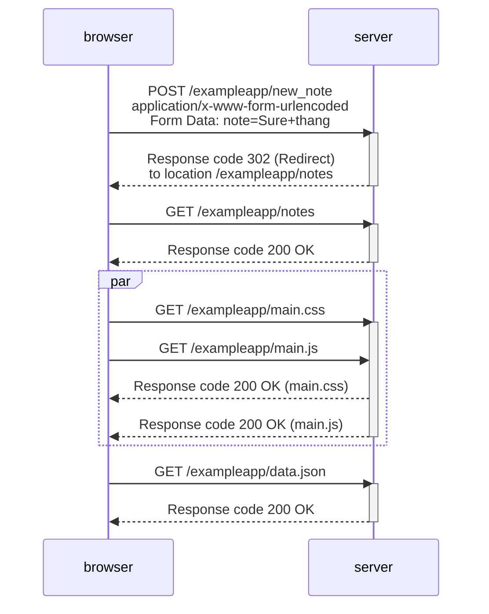

```mermaid

sequenceDiagram
    participant browser
    participant server

    browser->>server: POST /exampleapp/new_note<br>application/x-www-form-urlencoded<br>Form Data: note=Sure+thang
    activate server
    server-->>browser: Response code 302 (Redirect)<br>to location /exampleapp/notes
    deactivate server

    browser->>server: GET /exampleapp/notes
    activate server
    server-->>browser: Response code 200 OK
    deactivate server

    par
        browser->>server: GET /exampleapp/main.css
        activate server
        browser->>server: GET /exampleapp/main.js
        server-->>browser: Response code 200 OK (main.css)
        server-->>browser: Response code 200 OK (main.js)
        deactivate server
    end

    browser->>server: GET /exampleapp/data.json
    activate server
    server-->>browser: Response code 200 OK
    deactivate server

```
